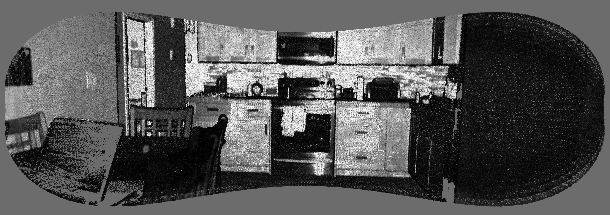
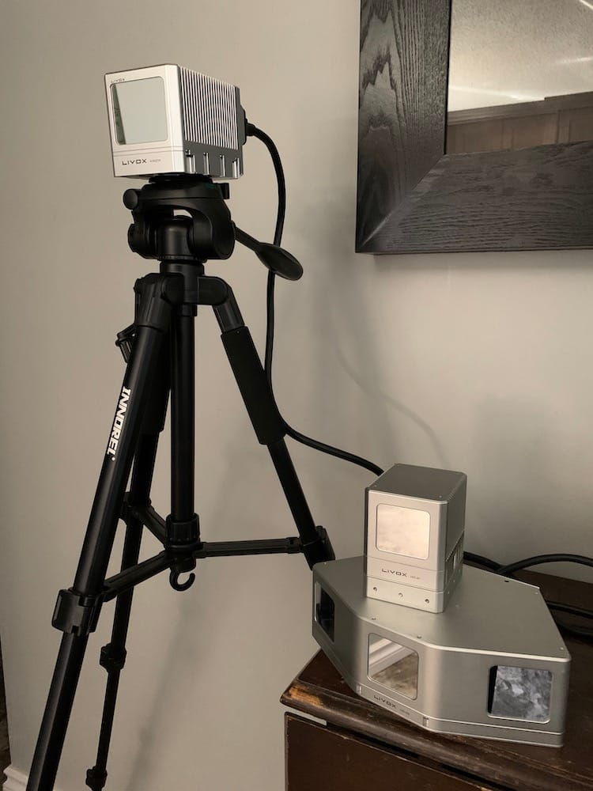

# OpenPyLivox (OPL)
The ***unofficial*** Python3 driver for Livox lidar sensors ;)

The OpenPyLivox (OPL) library is a near complete, fully pythonic, implementation of the Livox SDK. This means that almost all the functionality available within official Livox software (e.g., Livox-Viewer) and their C++ based API, has been included here within the OpenPyLivox library. *Ok, ok ... maybe not quite as cool or as functional as the Livox-Viewer, ... yet!*

This library and associated documentation, is designed for **ANYONE and EVERYONE** to be able to use it. From students and teachers interested in using lidar/laser scanning in STEM curriculum or projects, to researchers investigating lidar for autonomous vehicle/robot navigation!

***See the [Wiki](../../wiki) Pages for ~~complete~~ documentation!***
 - Documentation is currently being updated for the new features of v1.1.0, view the demo file below for how to access the new features.

Check out the [livox_controller_demo.py](./livox_controller_demo.py) file for a very detailed example on how to use the OpenPyLivox library to control and capture point cloud data from a single Livox sensor, as well as from multiple Livox sensors simultaneously!

*NOTES:* 
- OPL v1.1.0 has **NOW** been tested using Mid-40, Mid-100, and Horizon sensors (the Tele-15 should also work, but the developer does not own one)
- OPL automatically connects to all 3 individual Mid-40 sensors within a Mid-100 device, however, it was decided NOT to merge the point cloud datasets (i.e., there are 3 seperate files for a single Mid-100 device)
- Simultaneous operation of multiple Livox sensors has been tested, but not using a Livox Hub
- The library has been tested on Mac OS X, Linux (GalliumOS on HP Chromebook), and Windows 7 and 10
- The library has been tested to work with Livox firmwares:
  *MID-40/MID-100*
  - 03.03.0001 to 03.03.0007, all [special Livox firmwares](https://github.com/Livox-SDK/Special-Firmwares-for-Livox-LiDARs), including multiple returns ;)
  - 03.05.0000 to 03.08.0000, standard versions
  *HORIZON
  - 06.08.0000 to 06.10.0000, standard version
- OPL stored binary point data can be converted to CSV and/or LAS files
- OPL stored binary IMU data can be converted to CSV files
- The CSV and LAS point cloud data to be easily opened in the <b>amazing</b> open source software, CloudCompare (download at https://cloudcompare.org)

**Quirky Fact:** Intensity (a.k.a., Reflectivity in the Livox documentation) has a hyphen in the middle of it for OPL CSV point clouds in order to 'trick' CloudCompare into assigning the field as a scalar type by default. This enables displaying the point cloud in CloudCompare using a more visually appealing colour spectrum (e.g., left image below). It also provides a way to (possibly) help filter out some unwanted noisy data. Of course, the colour scheme can be changed to many other options, after importing the point cloud in CloudCompare (e.g., greyscale in right image below)

<table style="border:0px;">
  <tr style="border:0px;">
    <td style="border:0px;"></td>
    <td style="border:0px;"></td>
  </tr>
</table>
<table style="border:0px;">
  <tr style="border:0px;">
   <td style="border:0px;"></td>
   <td style="border:0px;"></td>
  </tr>
</table>

## Change Log:
- v1.0 released, **FRIDAY** Sept. **the 13th** 2019
- Wiki for v1.0 completed, Monday Sept. 23rd 2019
- Wiki v1.0 minor updates, Saturday Nov. 30th 2019
- v1.0.1 released, Wednesday May 27th 2020
- v1.0.2 and v1.0.3 released, Friday May 29th 2020
- v1.1.0 released, Friday Sept. 11th 2020 (NEVER FORGET!)

